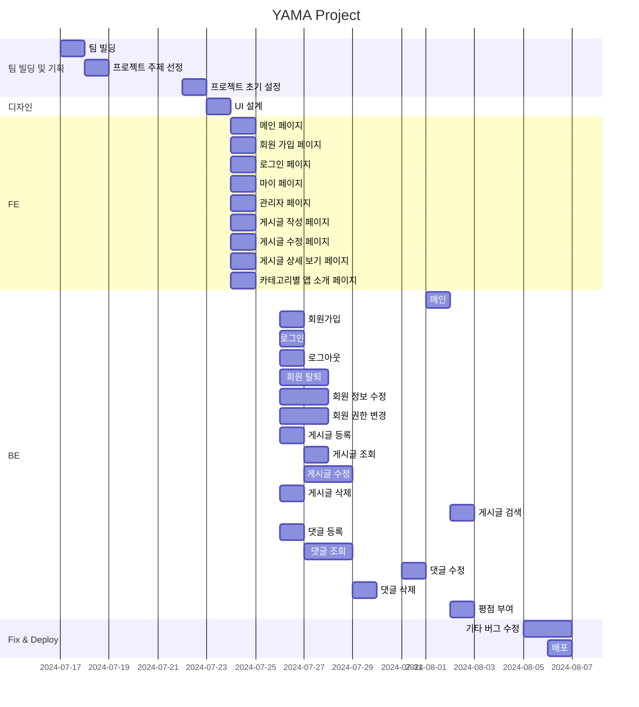
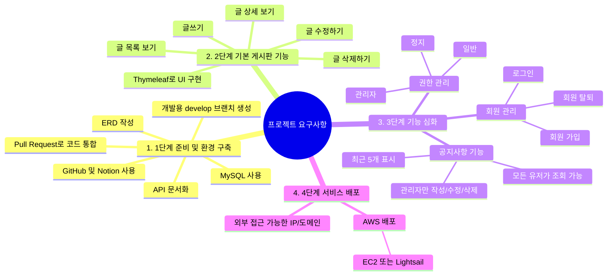
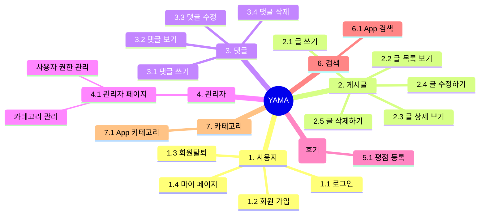

# Yama! 유용한 앱 공유 커뮤니티 서비스
## 목차
[1. 프로젝트 개요](#1-프로젝트-개요)  
[2. Git Convention](#2-git-convention)  
[3. 개발 환경 및 배포 URL](#3-개발-환경-및-배포-url)  
[4. 프로젝트 구조와 개발 일정](#4-프로젝트-구조와-개발-일정)  
[5. 요구사항과 기능 명세](#5-요구사항과-기능-명세)  
[6. 와이어프레임 / UI](#6-와이어프레임--ui)  
[7. 데이터베이스 모델링(ERD)](#7-데이터베이스-모델링erd)  
[8. 주요 기능](#8-주요-기능)  
[9. 개발 이슈](#9-개발-이슈)  
[10. 프로젝트를 진행하며 느낀점](#10-프로젝트를-진행하며-느낀점)  

## 1. 프로젝트 개요

### 1.1 프로젝트 명

- YAMA ( Your App! My App! )

### 1.2 프로젝트 설명
- 다양한 분야의 앱을 소개함으로써 여러 분야의 사람들과 공유하는 서비스입니다. 사용해본 앱을 카테고리 별로 나누어 링크를 포함한 설명 등으로 후기 작성이 가능하며 다른 사람의 소개 글에 평점과 함께 댓글을 남김으로써 앱에 대한 평가가 가능한 커뮤니티 서비스입니다.

### 1.3 프로젝트 기간
- '2024. 07. 22' ~ '2024. 08. 06'

### 1.4 역할 분담

- 팀장 : 이현준
- FE : 이현준, 이동현, 최의현
- BE : 이현준, 이동현, 최의현
- 디자인 : 이현준, 이동현, 최의현


## 2. Git Convention


## 3. 개발 환경 및 배포 URL
### 3.1 개발 환경

- IDE: IntelliJ IDEA 
- 서비스 배포 : Amazon Lightsail

### 3.2 기술 스택


- Thymeleaf: 3.3.1
- Spring Boot: 3.3.1
- Spring Security: 6.3.1
- Spring Data JPA: 3.1.0
- MySQL: 8.3.0

### 3.3 배포 URL
- http://3.36.65.194:8080/v1/main
- 테스트용 계정
  ```
  id : test@test.com
  pw : 1111
  ```

### 3.4 URL 구조

👱User

| URL                                                 | 요청 방식  | 설명                              
|-----------------------------------------------------|--------|---------------------------------|
| /v1/main                                            | GET    | 메인 페이지 요청                       | 
| /v1/login                                           | GET    | 로그인 페이지 요청                      | 
| /v1/signup                                          | GET    | 회원가입 페이지 요청                     | 
| /v1/signup                                          | POST   | 회원가입 요청                         | 
| /v1/user/{id}                                       | GET    | 해당 id를 가진 User의 마이페이지 요청        | 
| /v1/user/{id}                                       | PUT    | 해당 id를 가진 User의 마이페이지의 정보 수정 요청 | 
| /v1/user/{id}                                       | DELETE | 해당 id를 가진 User의 정보 삭제 요청        | 
| /v1/admin                                           | GET    | 관리자가 관리자 페이지 요청                 | 
| /v1/admin/{user_id}                                 | PUT    | 관리자가 해당 id를 가진 User의 권한 변경 요청   | 

📝Post

| URL                                                 | 요청 방식  | 설명                              
|-----------------------------------------------------|--------|---------------------------------|
| /v1/posts                                           | GET    | User가 게시글 리스트 페이지 요청            | 
| /v1/posts                                           | POST   | User가 새로운 게시글 작성 요청             | 
| /v1/posts/write                                     | GET    | User가 게시글 작성 페이지 요청             | 
| /v1/posts/notice/{id}/edit                          | GET    | Admin이 공지사항 수정 페이지 요청           | 
| /v1/posts/notice/{id}/edit                          | PUT    | Admin이 공지사항 수정 요청               | 
| /v1/posts/post/{id}/edit                            | GET    | User가 게시글 수정 페이지 요청             |
| /v1/posts/post/{id}/edit                            | PUT    | User가 게시글 수정 요청                 | 
| /v1/posts/notice/{id}                               | GET    | User가 공지사항 페이지 요청               | 
| /v1/posts/notice/{id}                               | DELETE | Admin이 공지사항 삭제 요청               | 
| /v1/posts/post/{id}                                 | GET    | User가 post_id에 해당하는 게시글 상세보기 요청 | 
| /v1/posts/post/{id}                                 | DELETE | User가 post_id에 해당하는 게시글 삭제 요청   |
| /v1/posts?categoryId={categoryId}&keyword={keyword} | GET    | 게시글 키워드 검색                      | 
| /v1/posts/article-items?categoryId={categoryId}     | GET    | 카테고리 ID에 따른 게시물 목록 요청           | 

🔖Comment

| URL                                                 | 요청 방식  | 설명                              
|-----------------------------------------------------|--------|---------------------------------|
| /v1/posts/{postId}/comments                         | GET    | 게시글에 작성된 댓글 조회 요청               | 
| /v1/posts/{postId}/comments                         | POST   | 게시글의 댓글 작성 요청                   | 
| /v1/posts/{postId}/comments/{commentId}             | PUT    | 게시글의 댓글 수정 요청                   | 
| /v1/posts/{postId}/comments                         | DELETE | 게시글의 댓글 삭제 요청                   | 
| /v1/posts/{postId}/average-rating                   | GET    | 게시글의 댓글 총 평점 조회 요청              |


## 4. 프로젝트 구조와 개발 일정

### 4.1 개발 일정





### 4.2 프로젝트 구조

도메인 주도 설계 원칙을 따르는 아키텍처 패턴으로 구현하였습니다.

📦Spring_Project   
┣ 📂application    
┃ ┣ 📂dto    
┃ ┃   ┣ 📜BoardDTO  
┃ ┃   ┣ 📜CategoryDTO    
┃ ┃   ┣ 📜CommentDTO   
┃ ┃   ┣ 📜NoticeDTO    
┃ ┃   ┣ 📜PostDTO    
┃ ┃   ┗ 📜UserDTO    
┃ ┣ 📜BoardService    
┃ ┣ 📜CategoryService   
┃ ┣ 📜CommentService   
┃ ┣ 📜NoticeService    
┃ ┣ 📜PostService    
┃ ┗ 📜UserService       
┣ 📂config   
┃ ┣ 📜PasswordEncoderConfig    
┃ ┣ 📜SecurityConfig   
┃ ┗ 📜UserStatusCheckFilter    
┣ 📂domain   
┃ ┣ 📜Authority    
┃ ┣ 📜Category   
┃ ┣ 📜Comment    
┃ ┣ 📜Notice   
┃ ┣ 📜Post   
┃ ┗ 📜User   
┣ 📂infrastructure   
┃ ┣ 📂config   
┃ ┃ ┣ 📜QueryDslConfig   
┃ ┃ ┣ 📜Category   
┃ ┃ ┣ 📜Comment    
┃ ┗ 📂persistence    
┃   ┣ 📜CategoryRepository   
┃   ┣ 📜CommentRepository   
┃   ┣ 📜NoticeRepository   
┃   ┣ 📜PostRepository   
┃   ┗ 📜UserRepository   
┗ 📂presentation   
  ┣ 📜BoardController    
  ┣ 📜CommentController    
  ┗ 📜UserController   

## 5. 요구사항과 기능 명세

### 요구 사항





### 기능 명세




## 6. 와이어프레임 / UI

### 6.1 와이어프레임


### 6.2 화면 설계


<table>
    <tbody>
        <tr>
            <td>메인</td>
            <td>로그인</td>
            <td>회원가입</td>
        </tr>
        <tr>
            <td>
                
            </td>
            <td>
                
            </td>
            <td>
                
            </td>
        </tr>
        <tr>
            <td>정보수정</td>
            <td>관리자 페이지</td>
            <td>게시글 리스트</td>
        </tr>
        <tr>
            <td>
                
            </td>
            <td>
                
            </td>
            <td>
                
            </td>
        </tr>
        <tr>
            <td>게시글 상세보기</td>
            <td>게시글 수정 / 삭제</td>
            <td>글쓰기</td>
        </tr>
        <tr>
            <td>
                
            </td>
            <td>
                
            </td>
            <td>
                
            </td>
        </tr>
    </tbody>
</table>


## 7. 데이터베이스 모델링(ERD)


## 8. 프로젝트를 진행하며 느낀점

- Spring Security를 시도해보자라는 생각으로 적용시켜보며 의도치 않게 접근 권한을 설정하게 되는 것과 같은 문제를 겪었다. 이를 해결하며 적절한 권한 설정이 중요하다는 것을 깨달았고, 커스터마이징을 하며 Spring Security의 유연함을 체험해 볼 수 있었다. 백엔드 구현에 있어 중요한 부분인만큼 방대한 학습량과 지식이 필요하다는 것도 알 수 있었다.

- 통합된 DTO인 BoardDTO를 인터페이스 혹은 추상클래스로 구현하여 DTO간 변환 없이 구현하고, 확장가능한 구현이 가능했을 것이라는 아쉬움이 생겼다. 좀 더 객체지향적으로 개발하는 방법을 구상 후 프로젝트를 시작하는 연습이 필요하다고 느꼈다.

- Thymeleaf를 사용하여 구현한 덕분에 초기 페이지 로딩이 빨라 개발에 이점을 가질 수 있었고 HTML을 그대로 유지하며 동적 기능을 추가하여 편리함을 느낄 수 있었다. 이 외에도 JavaScript를 사용하여 기능을 추가하며 통합 방식에 대해 고민해 볼 수 있었다.
