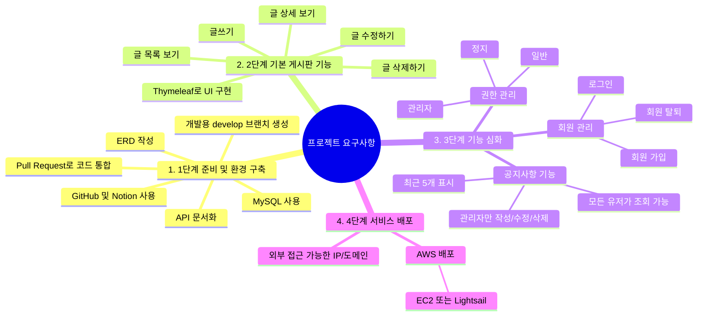
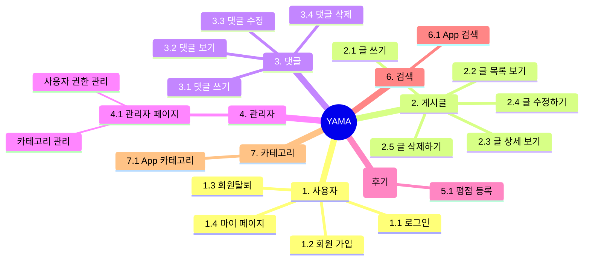

# Yama! 유용한 앱 공유 커뮤니티 서비스

## 1. 목표와 기능

### 1.1 목표
- 각자가 사용해본 앱 중 유용한 것을 공유하기 위한 커뮤니티 서비스
- 다양한 분야의 사람들에게 도움을 주는 커뮤니티 서비스

### 1.2 기능
- 사용해본 앱의 링크를 포함한 설명 등으로 사용해본 앱의 후기 작성
- 앱을 사용해본 후 해당 글에 평점과 함께 댓글 작성
- 카테고리 별로 나누어 앱의 후기를 작성 가능하고, 카테고리 별로 조회가 가능

### 1.3 역할 분담

- 팀장 : 이현준
- FE : 이현준, 이동현, 최의현
- BE : 이현준, 이동현, 최의현
- 디자인 : 이현준, 이동현, 최의현


## 2. Git Convention


## 3. 개발 환경 및 배포 URL
### 3.1 개발 환경

- IDE: IntelliJ IDEA 
- 언어: Java 17
- 빌드 도구: Gradle 8.x
- 서비스 배포 환경 : Amazon Lightsail

### 3.2 기술 스택


### 3.3 배포 URL
- https://www.studyin.co.kr/
- 테스트용 계정
  ```
  id : test@test.test
  pw : test11!!
  ```

### 3.3 URL 구조

| URL                                                 | 요청 방식  | 설명                              
|-----------------------------------------------------|--------|---------------------------------|
| /v1/main                                            | GET    | 메인 페이지 요청                       | 
| /v1/login                                           | GET    | 로그인 페이지 요청                      | 
| /v1/signup                                          | GET    | 회원가입 페이지 요청                     | 
| /v1/signup                                          | POST   | 회원가입 요청                         | 
| /v1/user/{id}                                       | GET    | 해당 id를 가진 User의 마이페이지 요청        | 
| /v1/user/{id}                                       | PUT    | 해당 id를 가진 User의 마이페이지의 정보 수정 요청 | 
| /v1/user/{id}                                       | DELETE | 해당 id를 가진 User의 정보 삭제 요청        | 
| /v1/admin                                           | GET    | 관리자가 관리자 페이지 요청                 | 
| /v1/admin/{user_id}                                 | PUT    | 관리자가 해당 id를 가진 User의 권한 변경 요청   | 
| /v1/posts                                           | GET    | User가 게시글 리스트 페이지 요청            | 
| /v1/posts                                           | POST   | User가 새로운 게시글 작성 요청             | 
| /v1/posts/write                                     | GET    | User가 게시글 작성 페이지 요청             | 
| /v1/posts/notice/{id}/edit                          | GET    | Admin이 공지사항 수정 페이지 요청           | 
| /v1/posts/notice/{id}/edit                          | PUT    | Admin이 공지사항 수정 요청               | 
| /v1/posts/post/{id}/edit                            | GET    | User가 게시글 수정 페이지 요청             |
| /v1/posts/post/{id}/edit                            | PUT    | User가 게시글 수정 요청                 | 
| /v1/posts/notice/{id}                               | GET    | User가 공지사항 페이지 요청               | 
| /v1/posts/notice/{id}                               | DELETE | Admin이 공지사항 삭제 요청               | 
| /v1/posts/post/{id}                                 | GET    | User가 post_id에 해당하는 게시글 상세보기 요청 | 
| /v1/posts/post/{id}                                 | DELETE | User가 post_id에 해당하는 게시글 삭제 요청   |
| /v1/posts?categoryId={categoryId}&keyword={keyword} | GET    | 게시글 키워드 검색                      | 
| /v1/posts/article-items?categoryId={categoryId}     | GET    | 카테고리 ID에 따른 게시물 목록 요청           | 
| /v1/posts/{postId}/comments                         | GET    | 게시글에 작성된 댓글 조회 요청               | 
| /v1/posts/{postId}/comments                         | POST   | 게시글의 댓글 작성 요청                   | 
| /v1/posts/{postId}/comments/{commentId}             | PUT    | 게시글의 댓글 수정 요청                   | 
| /v1/posts/{postId}/comments                         | DELETE | 게시글의 댓글 삭제 요청                   | 
| /v1/posts/{postId}/average-rating                   | GET    | 게시글의 댓글 총 평점 조회 요청              |


## 4. 프로젝트 구조와 개발 일정

### 4.1 개발 일정

wbs 첨부

### 4.2 프로젝트 구조

도메인 주도 설계 원칙을 따르는 아키텍처 패턴으로 구현하였습니다.

📦Spring_Project   
┣ 📂application    
┃ ┣ 📂dto    
┃ ┃   ┣ 📜BoardDTO  
┃ ┃   ┣ 📜CategoryDTO    
┃ ┃   ┣ 📜CommentDTO   
┃ ┃   ┣ 📜NoticeDTO    
┃ ┃   ┣ 📜PostDTO    
┃ ┃   ┗ 📜UserDTO    
┃ ┣ 📜BoardService    
┃ ┣ 📜CategoryService   
┃ ┣ 📜CommentService   
┃ ┣ 📜NoticeService    
┃ ┣ 📜PostService    
┃ ┗ 📜UserService       
┣ 📂config   
┃ ┣ 📜PasswordEncoderConfig    
┃ ┣ 📜SecurityConfig   
┃ ┗ 📜UserStatusCheckFilter    
┣ 📂domain   
┃ ┣ 📜Authority    
┃ ┣ 📜Category   
┃ ┣ 📜Comment    
┃ ┣ 📜Notice   
┃ ┣ 📜Post   
┃ ┗ 📜User   
┣ 📂infrastructure   
┃ ┣ 📂config   
┃ ┃ ┣ 📜QueryDslConfig   
┃ ┃ ┣ 📜Category   
┃ ┃ ┣ 📜Comment    
┃ ┗ 📂persistence    
┃   ┣ 📜CategoryRepository   
┃   ┣ 📜CommentRepository   
┃   ┣ 📜NoticeRepository   
┃   ┣ 📜PostRepository   
┃   ┗ 📜UserRepository   
┗ 📂presentation   
  ┣ 📜BoardController    
  ┣ 📜CommentController    
  ┗ 📜UserController   

## 5. 요구사항과 기능 명세

### 요구 사항

노션 글 그대로 갖다 쓰거나 or 아래 마인드맵 or 플로우차트




### 기능 명세

노션 글 그대로 갖다 쓰거나 or 아래 마인드맵 or 플로우차트



## 6. 와이어프레임 / UI / BM

### 6.1 와이어프레임
- 아래 페이지별 상세 설명, 더 큰 이미지로 하나하나씩 설명 필요


### 6.2 화면 설계


<table>
    <tbody>
        <tr>
            <td>메인</td>
            <td>로그인</td>
            <td>회원가입</td>
            <td>정보수정</td>
            <td>관리자 페이지</td>
        </tr>
        <tr>
            <td>
		            
            </td>
            <td>
                
            </td>
            <td>
                
            </td>
            <td>
                
            </td>
            <td>
	              
            </td>
        </tr>
        <tr>
            <td>게시글 리스트</td>
            <td>게시글 상세보기</td>
            <td>게시글 수정 / 삭제</td>
            <td>글쓰기</td>
        </tr>
        <tr>
            <td>
                
            </td>
            <td>
                
            </td>
            <td>
	              
            </td>
            <td>
                
            </td>
        </tr>
        <tr>
    </tbody>
</table>

## 7. 데이터베이스 모델링(ERD)


## 8. 개발하며 느낀점
- 이현준 :

- 이동현 :

- 최의현 : 서비스 흐름도를 기반으로 한 사용자 중심 설계부터 시작하여 깃허브를 통한 협업, 백엔드 구현, 그리고 배포까지 전 과정을 경험을 할 수 있었다. 스프링을 이용한 백엔드 개발이 처음이라 쉽지는 않았지만 구조를 이해하고, 구현을 하는 것에 익숙해 질 수 있었다.
